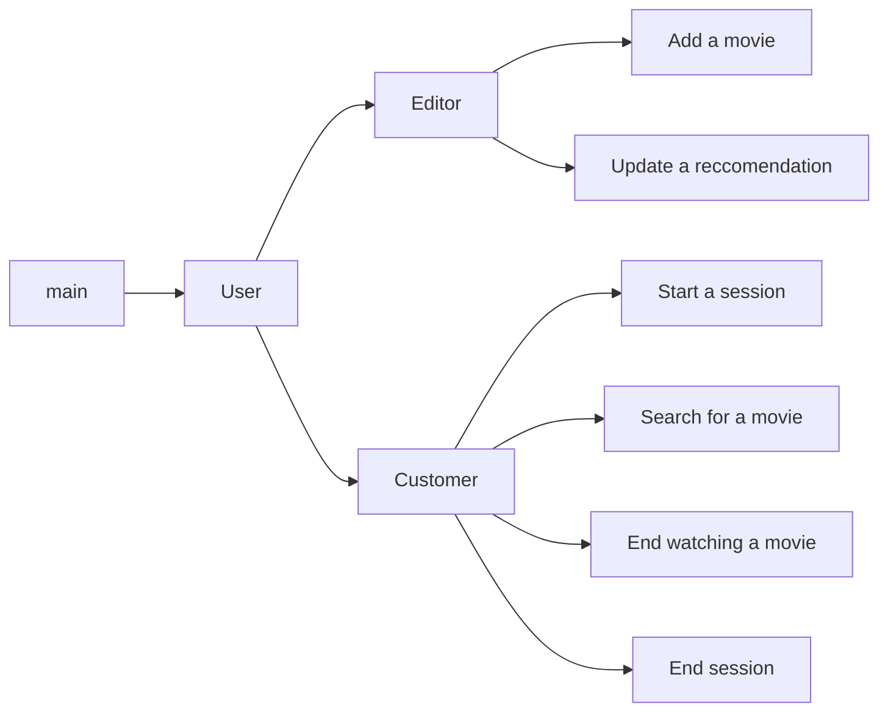

# Design & Documentation

## Overview

This project was designed to be as modular as possible, for example to allow a different type of user to be added with minimal effort. The `customer` and `editor` classes are where most of the interaction happens.



## Usage guide 

#### Command line usage 
```
./main.py <database path>
```
The database path must be provided.

Upon starting the program with a valid database, you will be presented with the following options:
```
 1. Sign up for new customer account
 2. Login with existing cID/eID
 3. Exit the program
```
You will be able to sign up for a customer account, login to an existing customer or editor account, or exit the program.

### Editor actions
Editors will be able to perform the following actions after logging in:
```
 1. Add a movie
 2. Update a recommendation
 3. Logout
```

### Customer actions
Customers will be able to perform the following actions after logging in:
```
 1. Start a session
 2. Search for movies
 3. End watching a movie
 4. End the session
 5. Logout
```

## Software design

 - `userabc.py` defines UserABC ("User Abstract Base Class") which implements high-level methods common to both Customer and Editor. For example choosing options for their type of user, authentications, and logging out
 - `editor.py` defines an Editor class which defines the methods to achieve everything listed under the Editor requirements in the spec
 - `customer.py` defines a Customer class which defines the methods to achieve everything listed under the Customer requirements in the spec
 - `main.py` contains code to handle initializing the database and taking initial user input to create Customer/Editor classes
 - `utils.py` contains utilities relating to getting user input restricted in some way, for example, getting an integer clamped to a range, picking a choice in a list of options, etc

### Liberties taken
Several liberties were taken to facilitate a smoother, more consistent user experience. 

 - We clear the screen whenever there's logical break in the actions of the user to keep unrelated distracting information off the screen. 
 - We provide the user the ability many times to confirm or go back in as many places as possible to avoid 'railroading' the user towards something they may not want to do. 
 - If our application crashes, we may not be able to store the duration of the movie being watched (as there is no appropriate field in the database to do so, and it's stored within our running application). If this happens, we insert a sentinel value of -1 to indicate the movie was watched _some_ amount and we're not sure how much.
 - Although the spec seemed to imply multiple sessions/watches were possible, based on the profs direction, we chose to assume that a customer will only ever have one open session and be watching one movie at a time to simplify the code surrounding session management 

### Testing strategy
The testing strategy discusses your general strategy for testing, with the scenarios being tested, the coverage of your test cases and (if applicable) some statistics on the number of bugs found and the nature of those bugs.

 - Every codepath was manually tested at least once manually by each group member as a sort of integration testing. The time to make thorough integrations test was prohibitive
 - Great care was taken to pay attention to potential edge cases, especially when working with oft-used utility functions. `utils.py` was tested with pytest with ~100% test coverage.

#### Bugs found

A large of bugs were present in the queries themselves. 
A lot of bugs arose due to the dynamically typed nature of python. Probably _the_ most commonly seen bug seen was due to the fact that results are always given as a tuple. So when fetching one item, you would expect to just be able to access that one item directly:
```python
max_field = cursor.execute("SELECT max(field) FROM table")
# WRONG, max_field is a tuple with a single element inside
print(max_field)
```

## Group work strategy
We used GitHub to store and collaborate on our code, and we communicated over Discord frequently both to keep each other accountable, ensuring each of our respective parts were getting done and to consult each other on anything not clear to either of us.

### Work breakdown
 - `mjmarcus`: responsible for overall design of the project, `Editor` class, and some utility functions, and the report
   - estimated time spent ~13h
 - `mmahmou1`: responsible for completion `Customer` class and some utility functions, and verifying the project meets specification in testing with our own database and the provided one
   - estimated time spent ~12h